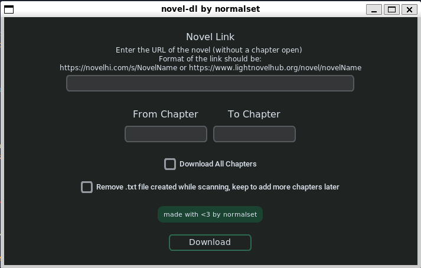

# novel-dl
A simple python script to automatically scrape web novels from [novelhi](https://novelhi.com), [lightnovelhub](https://www.lightnovelhub.org/home) (and more to come soon) and automatically compress them into an epub file for eReaders.

—

## Installation
Run this command in a terminal to install the required libraries:
```
pip3 install -r requirements.txt
```
(Tested on python 3.11.6)

## Usage
Run and follow the requests on the terminal 
```
python3 ui_novel_di.py # recommended

python3 novel_dl.py    # for terminal run
```
## Currently supported websites
- [lightnovelhub](https://www.lightnovelhub.org/home)
- [novelhi](https://novelhi.com) 
## Example run 

### UI using ui_novel_dl.py



### In terminal using novel-dl.py
- Initial prompt to insert the novel link and the first and last chapter to include in the final epub file


- Example of how the beginning of the download looks like


- Example of how the end of the download of a chapter looks like


- Example of how the compression into the final epub looks like


